# OpenTopography DEM Downloader
 QGIS Script tool to download DEMs from OpenTopography.org
 
 Add the script

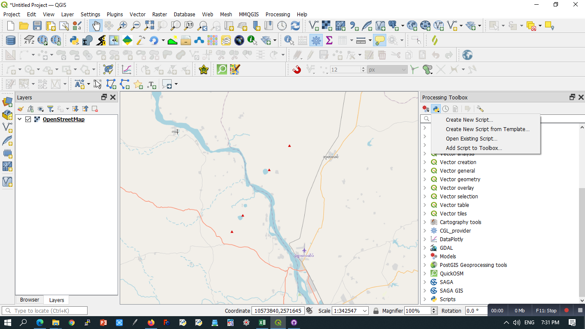

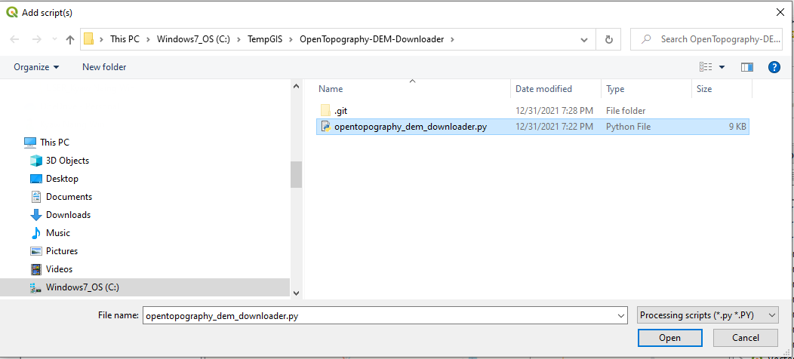

Tool will be appeared under Script\DEM tools as "OpenTopgraphy DEM downloader"

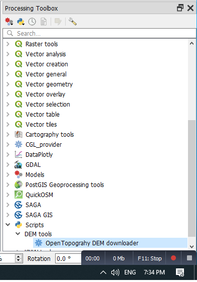

Double click the tool

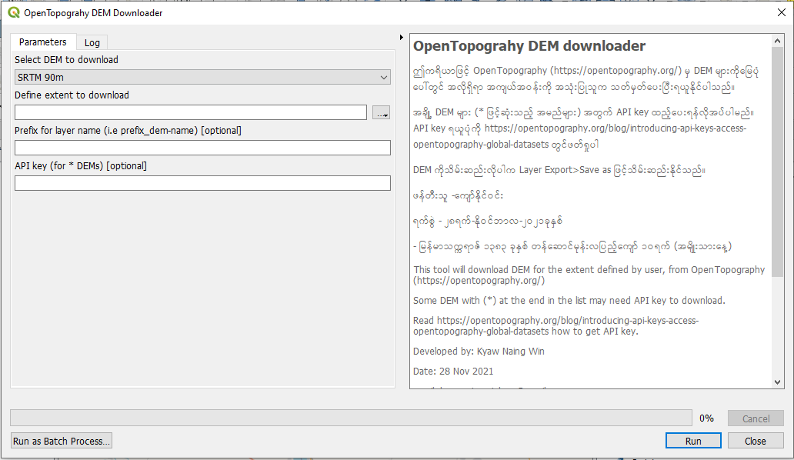

Select a DEM from the list
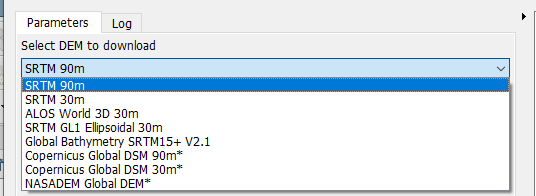

Define your extent with an option

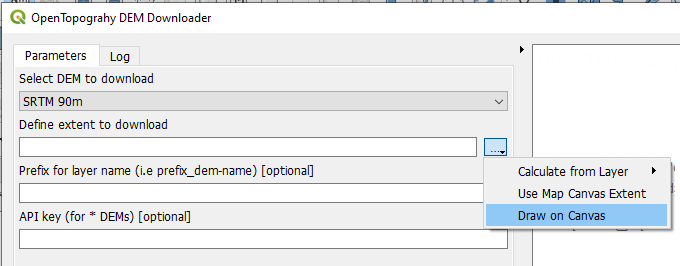

Example of drawing extent on the canvas

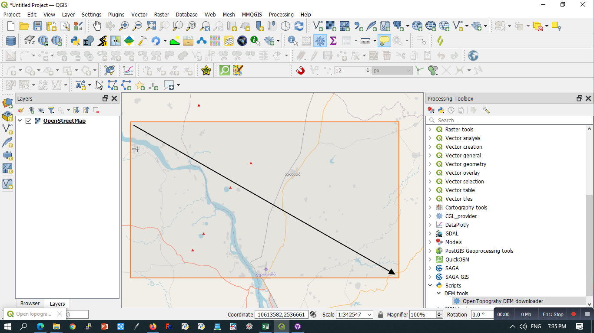

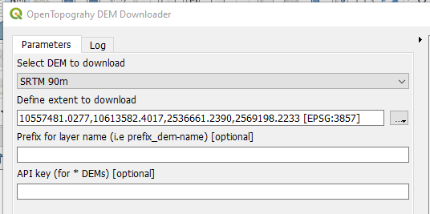

Give a name for the DEM layer

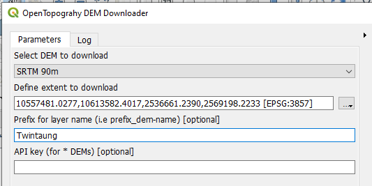

RUN

Once finished, the log screen will be something like this

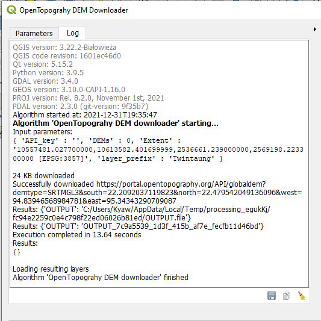

And DEM is now in the layer panel

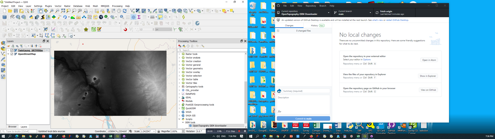

This layer is temporary and you need to save it for furture use.

Developed by Kyaw Naing Win.

Licnese: GNU GPLV3

DEM usage license is subject to OpenTopograpy.org
